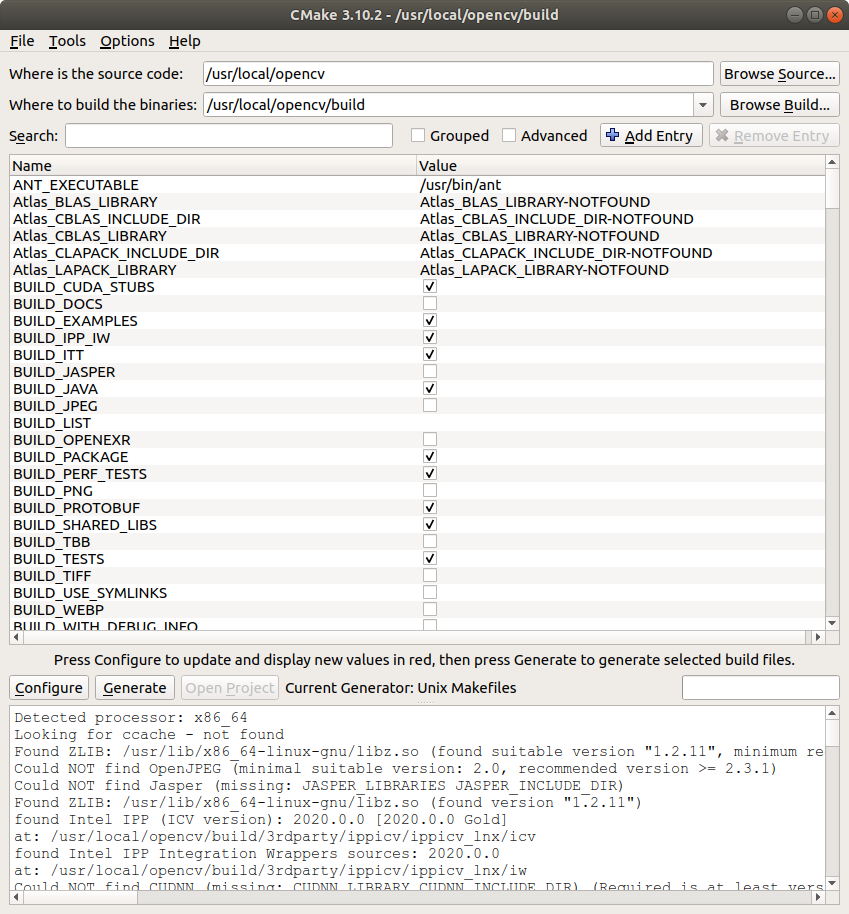
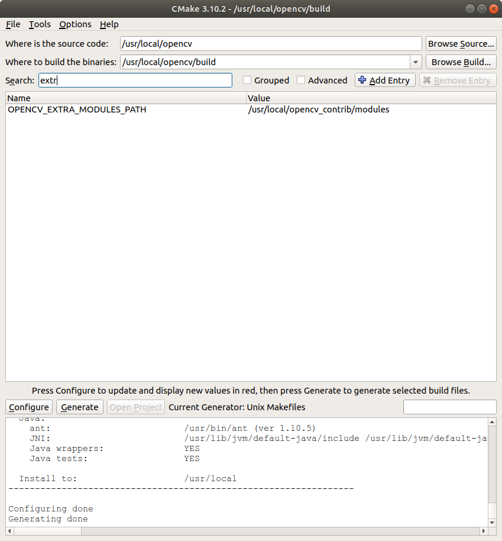

# Building OpenCV on Ubuntu via Cmake-GUI
The tutorial provides detailed guidelines for building OpenCV in a Linux environment

## Downloading sources
- Clone both the OpenCV and OpenCV Contrib sources as follows: 
```
git clone https://github.com/opencv/opencv.git
git clone https://github.com/opencv/opencv_contrib.git
```

- Extract both the files in usr/local for the build process via cmake

```
sudo mv ~/opencv_source/opencv /usr/local
sudo mv ~/opencv_source/opencv_contrib/ /usr/local
```
- Go to OpenCV directory and create a build folder
```
cd opencv
mkdir build
```
- Install the cmake-gui tool
```
sudo apt  install cmake-qt-gui
```
- Install Qt5 dependencies
```
sudo apt-get install qtbase5-dev
sudo apt-get install qtdeclarative5-dev
```
## Run the following cmake command to build OpenCV source
* Press the Configure button and once the process finishes, press the Generate button next to it:

CMake-GUI main window: 


-  Go to the Search textbox and type "EXTRA" to bringup the "OPENCV_EXTRA_MODULES_PATH"



## Make and install
- Now go to your build folder and run the following commands (the make command will take a considerable amount of time)
```
make -j4
sudo make install
```
